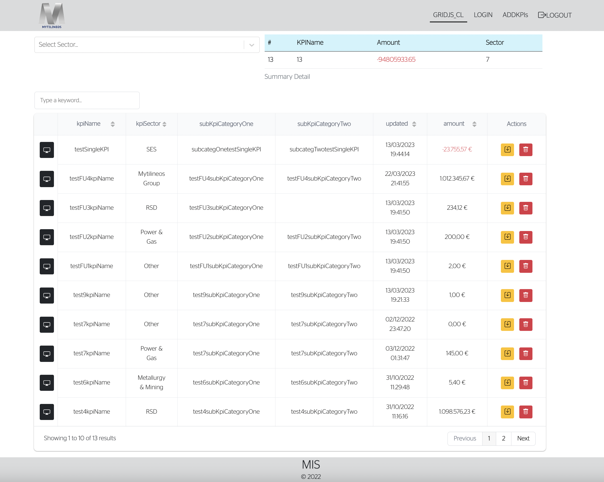

# Installation guide

git clone https://github.com/feddieminas/react-django-kpis

#Setup Backend
1. cd react-django-kpis/backend
2. pip install -r requirements.txt
3. python manage.py createsuperuser
4. python manage.py runserver
5. To load as a quick example some kpis => python manage.py loaddata kpis.json

#Setup Frontend
1. cd react-django-kpis/frontend
2. npm install
3. npm start